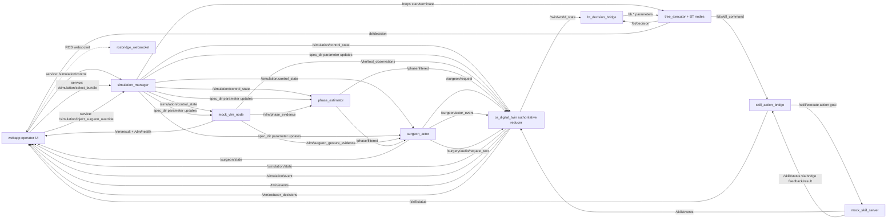
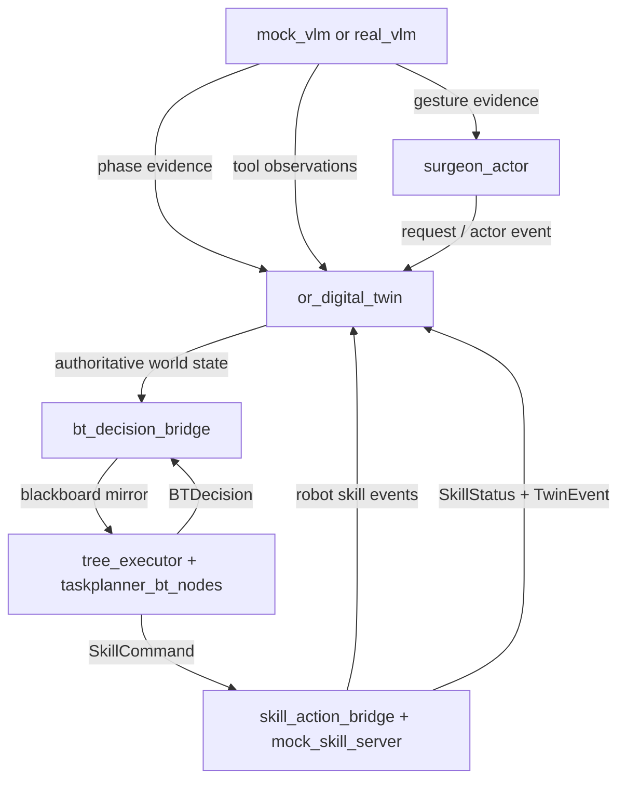
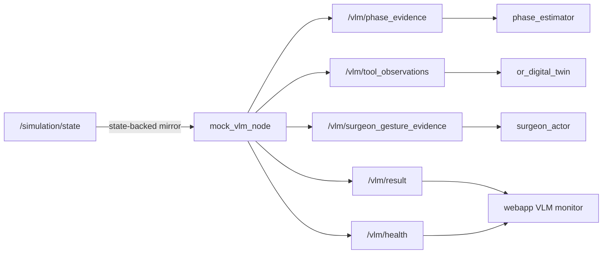
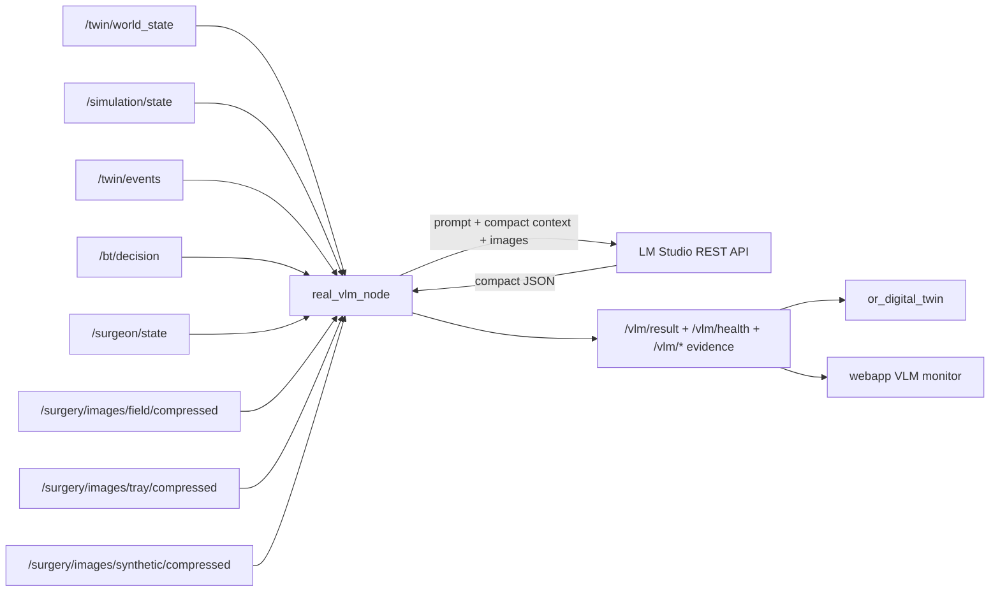

# Taskplanner System Structure

Last reviewed: 2026-04-28 KST

This document describes the current runtime structure of `/home/arl/taskplanner_ws` after the
Authoritative Single-Twin changes. It is intended as the current working map for development,
debugging, and validation.

## 1. Architectural Rule

The current system uses one authoritative runtime state:

```text
surgeon actor events
robot skill events
VLM observations / proposals
phase evidence
control commands
        |
        v
or_digital_twin reducer
        |
        v
/twin/world_state + /simulation/state
```

There is no separate truth-twin / belief-twin split in the active implementation.

Core ownership rules:

- `or_digital_twin` owns authoritative instrument lifecycle, runtime state, active robot task, event log, and frontend state snapshots.
- Robot BT reads `/twin/world_state` via blackboard mirroring and emits decisions / skill commands. It must not directly mutate state.
- `surgeon_actor` reads the twin and emits surgeon intent / actor events. It must not directly mutate state.
- VLM nodes publish evidence and observations. The twin reducer accepts, rejects, or quarantines their effects.
- The frontend renders `/simulation/state`, `/surgeon/state`, `/bt/decision`, `/skill/status`, `/vlm/health`, `/vlm/result`, and `/vlm/reducer_decisions`. It is not a source of truth.

## 2. Packages

### `procedure_spec`

Static procedure bundle loader and query layer.

Important paths:

- `src/procedure_spec/procedure_spec/specs/thyroidectomy`
- `src/procedure_spec/procedure_spec/specs/nephrectomy`
- `display_catalog.yaml`

Bundle files:

- `procedure.yaml`: phase order and phase metadata.
- `instruments.yaml`: instrument ids, names, home tray slots.
- `policy.yaml`: expected tools / behavior policy.
- `mock_perception.yaml`: mock VLM scenario data.
- `mock_surgeon.yaml`: legacy / template surgeon request data.
- `scene_layout.yaml`, `simulation_layout.yaml`: layout anchors used by runtime and rendering.

### `vlm_node`

VLM and visual input layer.

Executables:

- `mock_vlm`: state-backed mock VLM. Publishes `/vlm/phase_evidence`, `/vlm/tool_observations`, `/vlm/surgeon_gesture_evidence`, `/vlm/result`, `/vlm/health`.
- `real_vlm`: LM Studio-backed VLM node. Consumes images and compact runtime context, publishes VLM outputs.
- `synthetic_scene_camera`: renders a synthetic scene image from `/simulation/state`.
- `snapshot_bridge`: polls an HTTP snapshot URL and publishes `/surgery/images/field/compressed`.

Current real VLM inputs:

- `/twin/world_state`
- `/simulation/state`
- `/twin/events`
- `/bt/decision`
- `/surgeon/state`
- `/surgery/images/field/compressed`
- `/surgery/images/tray/compressed`
- `/surgery/images/synthetic/compressed`

Current real VLM outputs:

- `/context/phase_summary`
- `/context/tool_lifecycle_summary`
- `/context/event_digest`
- `/context/bt_context_snapshot`
- `/context/vlm_request_context`
- `/vlm/result`
- `/vlm/health`
- `/vlm/phase_evidence`
- `/vlm/tool_observations`
- `/vlm/surgeon_gesture_evidence`

Implementation note:

- `real_vlm` already uses request-level system/developer prompts and client-side schema validation.
- Strict LM Studio `response_format.json_schema` enforcement is not yet wired into `lmstudio_client.py`; current enforcement is prompt + parse/validate/retry/fallback.

### `phase_estimator`

Filters VLM phase evidence into `/phase/filtered`.

Inputs:

- `/vlm/phase_evidence`
- `/twin/world_state`
- `/simulation/control_state`

Output:

- `/phase/filtered`

### `simulation_runtime`

Runtime control and surgeon-side actor policy.

Executables:

- `simulation_manager`: service surface for start/stop/reset/bundle switch/override.
- `surgeon_actor`: active surgeon actor policy used by current launch.
- `mock_surgeon`: legacy scripted surgeon node. Not used by the current default launch.

Important services:

- `/simulation/control`
- `/simulation/select_bundle`
- `/simulation/inject_surgeon_override`

Important topics:

- `/simulation/control_state`
- `/simulation/surgeon_override`
- `/surgeon/state`
- `/surgeon/request`
- `/surgeon/actor_event`
- `/surgery/audio/request_text`

### `or_digital_twin`

Authoritative reducer and state publisher.

Inputs:

- `/surgeon/actor_event`
- `/vlm/tool_observations`
- `/skill/events`
- `/surgery/audio/request_text`
- `/surgeon/request`
- `/phase/filtered`
- `/simulation/control_state`

Outputs:

- `/twin/world_state`
- `/twin/tool_states`
- `/twin/events`
- `/simulation/state`
- `/simulation/event`
- `/twin/vlm_context_summary`
- `/twin/vlm_request_context`
- `/twin/important_event`
- `/vlm/inference_proposals`
- `/vlm/reducer_decisions`

State model highlights:

- `InstrumentState.lifecycle_stage` is the semantic lifecycle stage.
- `InstrumentState.location_type/location_id` is the physical/logical location.
- `InstrumentState.visual_anchor_id` is the preferred frontend anchor.
- `SimulationState.active_robot_task_*` describes in-progress robot motion/task progress.
- Cleaner completion currently resolves to rack return semantics through the reducer.

Important limitation:

- Surgeon-held and field-fixed tools are still coarse-grained. `surgeon_hand`, `surgical_field`, `bed_fixed_tool`, and `return_zone` are all normalized as `surgeon_owned`.
- The current messages do not expose authoritative `surgeon_right_hand_tool`, `surgeon_left_hand_tool`, or `field_fixed_tools`.

### `bt_orchestrator`

Bridge between authoritative twin state and BT blackboard.

Executable:

- `decision_bridge`

Responsibilities:

- Subscribes to `/twin/world_state`, `/bt/decision`, `/skill/status`.
- Mirrors world state into `/tree_executor` parameters under `bb.*`.
- Publishes human-readable `/bt/decision_summary`.

### `taskplanner_bt_trees`

BT XML package.

Important file:

- `src/taskplanner_bt_trees/behavior/surgical_assist_v1.xml`

Main tree:

- `TaskplannerAssistDemo`

### `taskplanner_bt_nodes`

C++ BT node plugin package.

Responsibilities:

- Reads blackboard world state.
- Selects explicit request / recovery / anticipatory / idle branches.
- Publishes `/bt/decision`.
- Publishes `/bt/skill_command`.

Important files:

- `src/taskplanner_bt_nodes/src/taskplanner_bt_nodes.cpp`
- `src/taskplanner_bt_nodes/config/taskplanner_bt_nodes.yaml`

### `skill_execution`

Robot skill dispatch and mock execution.

Executables:

- `skill_action_bridge`: converts `/bt/skill_command` into `/skill/execute` action goals.
- `mock_skill_server`: staged mock action server that emits progress and skill events.

Important topics/actions:

- `/bt/skill_command`
- `/skill/status`
- `/skill/events`
- `/skill/execute`

### `surgical_msgs`

Shared ROS message/service/action definitions.

Important state messages:

- `WorldState.msg`
- `SimulationState.msg`
- `InstrumentState.msg`
- `BTDecision.msg`
- `SkillCommand.msg`
- `SkillStatus.msg`
- `SurgeonActorEvent.msg`
- `SurgeonRequest.msg`
- `SurgeonState.msg`
- `VLMResult.msg`
- `VLMHealth.msg`
- `VLMReducerDecision.msg`

Important services/actions:

- `ControlSimulation.srv`
- `SelectSimulationBundle.srv`
- `InjectSurgeonOverride.srv`
- `ExecuteSkill.action`

### `bringup`

Launch and validation package.

Executable tests:

- `taskplanner_smoke_test`
- `taskplanner_manual_probe`
- `taskplanner_bt_audit`

Launch:

- `src/bringup/launch/taskplanner_mock.launch.py`

### `webapp`

Vite React frontend.

Important files:

- `webapp/src/App.tsx`
- `webapp/src/hooks/useRosBridge.ts`
- `webapp/src/hooks/useDigitalTwinViewModel.ts`
- `webapp/src/components/stage/OperatingRoomStage.tsx`
- `webapp/src/components/observability/ObservabilityPanel.tsx`
- `webapp/src/components/command/*`
- `webapp/src/layouts.ts`
- `webapp/src/visualLayouts.ts`

Frontend data sources:

- `/simulation/state`
- `/simulation/event`
- `/surgeon/state`
- `/bt/decision`
- `/skill/status`
- `/vlm/health`
- `/vlm/result`
- `/vlm/reducer_decisions`

The frontend should be treated as an operator/debug view, not as runtime truth.

## 3. Default Launch Stack

Default command:

```bash
source /opt/ros/jazzy/setup.bash
source /home/arl/btops_ws/install/setup.bash
source /home/arl/taskplanner_ws/install/setup.bash
ros2 launch bringup taskplanner_mock.launch.py
```

Default nodes:

- `btops_gateway`
- `tree_executor`
- `mock_vlm_node`
- `synthetic_scene_camera`
- `surgeon_actor`
- `phase_estimator`
- `or_digital_twin`
- `mock_skill_server`
- `skill_action_bridge`
- `bt_decision_bridge`
- `simulation_manager`
- `rosbridge_websocket`

Launch arguments:

- `spec_dir`: procedure bundle directory. Defaults to thyroidectomy.
- `vlm_mode`: `mock | real | dual`.
- `vlm_base_url`: LM Studio base URL.
- `vlm_model_id`: LM Studio model id.
- `vlm_response_mode`: `live | replay | oracle`.
- `enable_synthetic_scene_camera`: enables synthetic image publisher.
- `field_snapshot_url`: enables HTTP snapshot bridge when non-empty.
- `enable_rosbridge`, `rosbridge_port`.

## 4. Runtime Flow

### Start / reset / bundle switch

```text
webapp
  -> /simulation/control or /simulation/select_bundle
simulation_manager
  -> /simulation/control_state
  -> updates spec_dir on mock_vlm / real_vlm / phase_estimator / twin / surgeon_actor
  -> starts or terminates BT executor through btops services
```

### Perception / VLM

```text
mock_vlm or real_vlm
  -> /vlm/phase_evidence
  -> /vlm/tool_observations
  -> /vlm/surgeon_gesture_evidence
  -> /vlm/result
  -> /vlm/health
```

### Phase

```text
/vlm/phase_evidence + /twin/world_state
  -> phase_estimator
  -> /phase/filtered
```

### Surgeon actor

```text
/twin/world_state + /phase/filtered + /vlm/surgeon_gesture_evidence + /simulation/surgeon_override
  -> surgeon_actor
  -> /surgeon/request
  -> /surgeon/state
  -> /surgeon/actor_event
  -> /surgery/audio/request_text
```

### Authoritative twin

```text
/surgeon/actor_event
/vlm/tool_observations
/skill/events
/surgery/audio/request_text
/surgeon/request
/phase/filtered
/simulation/control_state
  -> or_digital_twin reducer
  -> /twin/world_state
  -> /simulation/state
  -> /twin/events
  -> /simulation/event
  -> /vlm/reducer_decisions
```

### BT decision and skill execution

```text
/twin/world_state
  -> bt_decision_bridge
  -> /tree_executor bb.* parameters
  -> BT nodes
  -> /bt/decision
  -> /bt/skill_command
  -> skill_action_bridge
  -> /skill/execute action
  -> mock_skill_server
  -> /skill/status
  -> /skill/events
  -> or_digital_twin
```

## 5. Current Structural Gaps

These are known structure-level issues, not just UI defects.

1. Surgeon hands and field-fixed tools are not authoritative.
   - `surgeon_owned` currently covers `surgeon_hand`, `surgical_field`, `bed_fixed_tool`, and `return_zone`.
   - There is no first-class `surgeon_right_hand_tool`, `surgeon_left_hand_tool`, or `field_fixed_tools`.
   - Frontend left/right surgeon holders are partly derived visual lanes, not guaranteed truth.

2. VLM strict schema enforcement is incomplete.
   - System/developer prompts and schema validation exist.
   - LM Studio `response_format.json_schema` is not yet added to the client request body.

3. Legacy `mock_surgeon` remains in the package.
   - Current launch uses `surgeon_actor`.
   - `mock_surgeon` should be treated as a legacy/test-only path unless explicitly launched.

4. Layout sources are split.
   - `layouts.ts`, `visualLayouts.ts`, procedure `simulation_layout.yaml`, and runtime `layout_json` all describe related geometry.
   - This is functional but increases risk of visual drift.

5. `bringup/config/taskplanner.yaml` is partially stale.
   - The launch file now carries most runtime timing parameters directly.
   - Treat the launch file as the current source for default runtime parameters.

## 6. Common Development Targets

### Add or change procedure tools/phases

Edit:

- `src/procedure_spec/procedure_spec/specs/<bundle>/procedure.yaml`
- `src/procedure_spec/procedure_spec/specs/<bundle>/instruments.yaml`
- `src/procedure_spec/procedure_spec/specs/<bundle>/policy.yaml`
- `src/procedure_spec/procedure_spec/specs/<bundle>/simulation_layout.yaml`

Then rebuild or reinstall `procedure_spec`.

### Change lifecycle or invariant behavior

Edit:

- `src/or_digital_twin/or_digital_twin/twin.py`
- `src/or_digital_twin/or_digital_twin/models.py`
- relevant `surgical_msgs/msg/*.msg` if the public contract changes.

### Change BT decisions

Edit:

- `src/taskplanner_bt_trees/behavior/surgical_assist_v1.xml`
- `src/taskplanner_bt_nodes/src/taskplanner_bt_nodes.cpp`
- `src/bt_orchestrator/bt_orchestrator/selectors.py`
- `src/bt_orchestrator/bt_orchestrator/guards.py`

### Change robot motion timing

Edit:

- `src/bringup/launch/taskplanner_mock.launch.py`
- `src/skill_execution/skill_execution/mock_server.py`
- `src/skill_execution/skill_execution/bridge.py`

### Change VLM behavior

Edit:

- `src/vlm_node/vlm_node/real_vlm.py`
- `src/vlm_node/vlm_node/lmstudio_client.py`
- `src/vlm_node/vlm_node/schema.py`
- `src/vlm_node/vlm_node/prompt_builder.py`
- `src/vlm_node/vlm_node/node.py` for mock VLM.

### Change frontend operator view

Edit:

- `webapp/src/App.tsx`
- `webapp/src/hooks/useRosBridge.ts`
- `webapp/src/hooks/useDigitalTwinViewModel.ts`
- `webapp/src/components/stage/OperatingRoomStage.tsx`
- `webapp/src/components/observability/ObservabilityPanel.tsx`
- `webapp/src/utils/display.ts`
- `webapp/src/styles.css`

## 7. Validation Commands

```bash
source /opt/ros/jazzy/setup.bash
source /home/arl/btops_ws/install/setup.bash
source /home/arl/taskplanner_ws/install/setup.bash

cd /home/arl/taskplanner_ws/webapp
npm run build

ros2 run bringup taskplanner_smoke_test --spec-name thyroidectomy
ros2 run bringup taskplanner_smoke_test --spec-name nephrectomy
ros2 run bringup taskplanner_manual_probe --spec-name thyroidectomy
ros2 run bringup taskplanner_manual_probe --spec-name nephrectomy
ros2 run bringup taskplanner_bt_audit --spec-name thyroidectomy
ros2 run bringup taskplanner_bt_audit --spec-name nephrectomy
```

For manual frontend testing:

```bash
ros2 launch bringup taskplanner_mock.launch.py

cd /home/arl/taskplanner_ws/webapp
npm run dev -- --host 127.0.0.1 --port 4173
```

## 8. Major Component Relationship Graphs

### 8.1 Default Mock Runtime

This is the default `vlm_mode=mock` stack used by `taskplanner_mock.launch.py`.



### 8.2 Decision Loop

This is the core closed loop that should remain authoritative-state driven.



Key rule:

- BT never consumes raw VLM or frontend state directly.
- BT consumes the authoritative state after `or_digital_twin` has reduced actor events, VLM observations, phase evidence, and skill events.

### 8.3 Mock VLM Path

`mock_vlm` is not a direct controller. It is a perception/gesture evidence producer.



Important behavior:

- In current default mode, `mock_vlm` mirrors authoritative `/simulation/state` into VLM-like observations.
- This is useful for integration testing, but it is not an independent perception benchmark.
- Illegal tool observations should be rejected or quarantined by the twin reducer instead of directly rebasing state.

### 8.4 Real VLM Optional Path

When `vlm_mode=real`, `real_vlm` replaces the `/vlm/*` producer. When `vlm_mode=dual`, `mock_vlm` remains on `/vlm/*` and `real_vlm` publishes under `/vlm_real/*` and `/context_real/*`.



Current caveat:

- `real_vlm` validates compact JSON client-side.
- Request-level strict `response_format.json_schema` is not yet wired into the LM Studio client.

