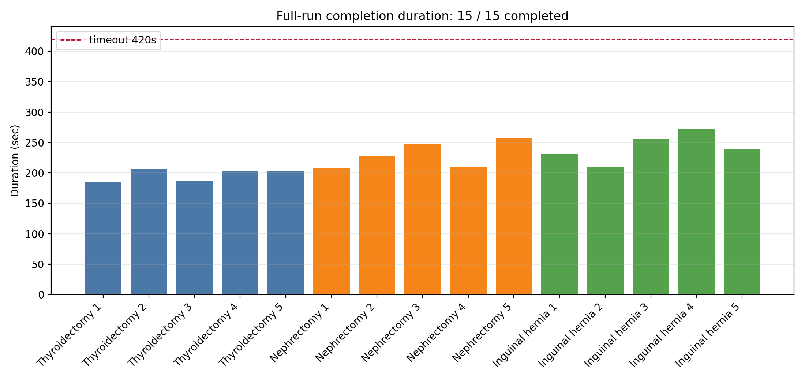
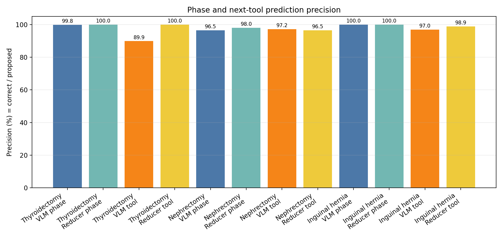
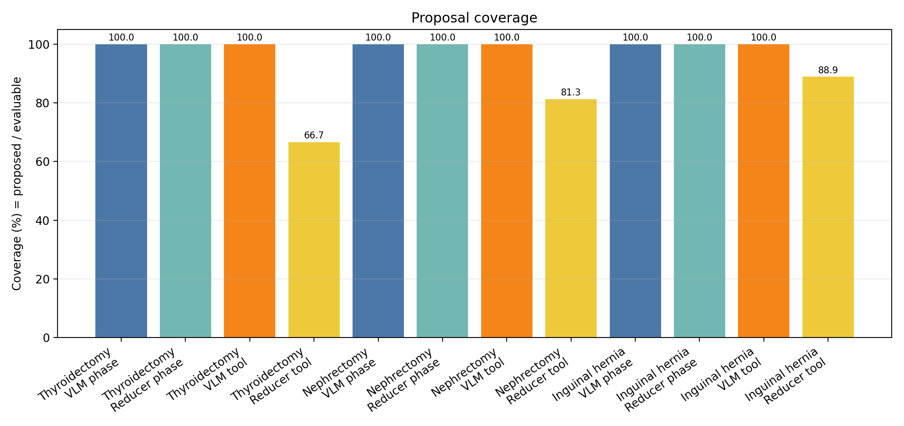
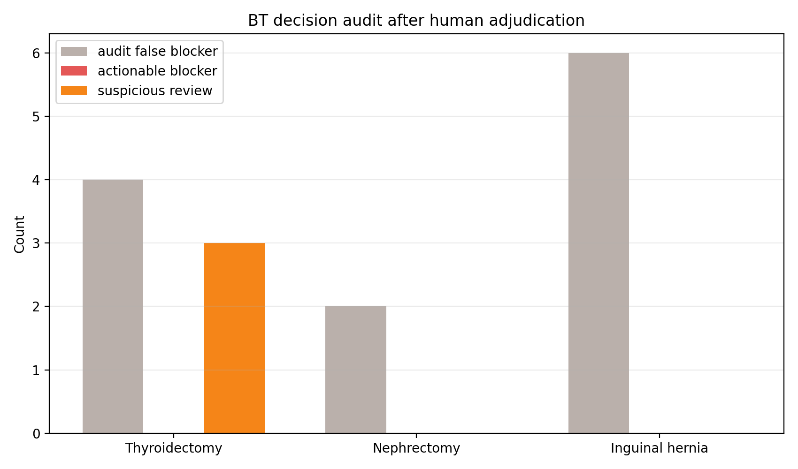
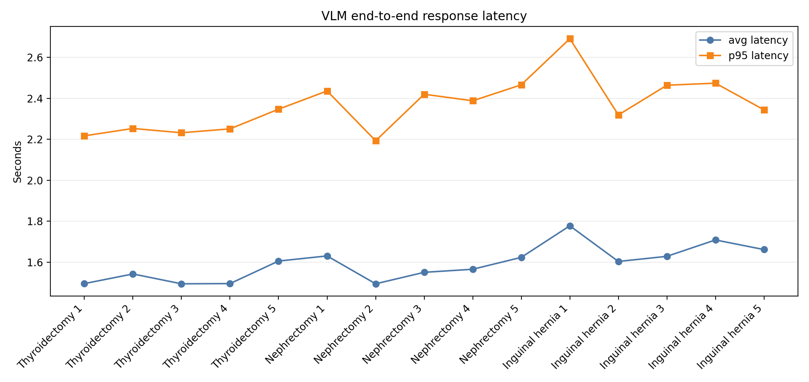

# Taskplanner 0.1.0 Full-run Evaluation Report

생성 시각: 2026-06-24 12:49:31  
원본 로그: `reports/full_run_eval_20260624_114610/full_run_raw.json`

## 결론

- 3개 수술 번들 x 5회, 총 15회 full-run을 처음부터 수술 종료 정리까지 실행했고 **15/15회 모두 completed**로 종료했다.
- VLM은 전 회차에서 `openai_compat` real-model 경로, schema v3로 응답했고, health sample은 **2096/2096 정상**이었다.
- Phase 판단은 raw VLM **1850/1874/1874 (98.7%)**, reducer/system fused **1861/1874/1874 (99.3%)**였다.
- 다음 도구 예측은 raw VLM **262/275/275 (95.3%)**, reducer/system fused **217/221/275 (98.2%)**였다.
- BT human adjudication 기준 actionable blocker는 **0건**이다. 단, thyroidectomy에서 anticipatory handover가 현재 phase expected list 밖 도구를 미리 든 suspicious case가 **3건** 남았다.

점수 표기는 모두 `맞힌 것 / 실제 제안한 것 / 평가 가능한 전체` 순서다.

## 입력 누설 기준

- VLM의 speech 입력은 실제 transcript 경로(`/surgery/audio/request_text`, `VoiceTranscriptObserved`)에서만 수집하는 것을 기준으로 평가했다.
- `SurgeonRequestObserved`, actor event, outward signal은 speech로 쓰지 않고 public gesture/tool event로만 쓴다.
- LLM 집도의가 phase 전환을 발화하지 않는 것은 별도 성능 평가가 아니라 기본 전제다. 이번 raw의 accepted speech 기준 phase label/transition phrase 위반은 **0건**이다.
- VLM context forbidden fragment는 **0건**, VLM overlay leak은 **0건**이다.

## 번들별 요약

| Procedure | Completion | Avg duration | VLM phase | System phase | VLM tool | System tool | BT actionable/suspicious |
|---|---:|---:|---:|---:|---:|---:|---:|
| Thyroidectomy | 5/5 | 197.0s | 572/573/573 (99.8%) | 573/573/573 (100.0%) | 62/69/69 (89.9%) | 46/46/69 (100.0%) | 0 / 3 |
| Nephrectomy | 5/5 | 230.0s | 630/653/653 (96.5%) | 640/653/653 (98.0%) | 104/107/107 (97.2%) | 84/87/107 (96.5%) | 0 / 0 |
| Inguinal hernia | 5/5 | 241.5s | 648/648/648 (100.0%) | 648/648/648 (100.0%) | 96/99/99 (97.0%) | 87/88/99 (98.9%) | 0 / 0 |

## Run별 상세

| Procedure | Run | Duration | VLM phase | System phase | VLM tool | System tool | BT blocker | BT suspicious |
|---|---:|---:|---:|---:|---:|---:|---:|---:|
| Thyroidectomy | 1 | 185.0s | 110 / 110 / 110 | 110 / 110 / 110 | 15 / 15 / 15 | 11 / 11 / 15 | 0 | 1 |
| Thyroidectomy | 2 | 206.7s | 118 / 118 / 118 | 118 / 118 / 118 | 3 / 4 / 4 | 4 / 4 / 4 | 0 | 1 |
| Thyroidectomy | 3 | 187.0s | 111 / 111 / 111 | 111 / 111 / 111 | 25 / 25 / 25 | 15 / 15 / 25 | 0 | 0 |
| Thyroidectomy | 4 | 202.6s | 119 / 120 / 120 | 120 / 120 / 120 | 9 / 15 / 15 | 7 / 7 / 15 | 0 | 0 |
| Thyroidectomy | 5 | 203.7s | 114 / 114 / 114 | 114 / 114 / 114 | 10 / 10 / 10 | 9 / 9 / 10 | 0 | 1 |
| Nephrectomy | 1 | 207.1s | 106 / 109 / 109 | 108 / 109 / 109 | 31 / 33 / 33 | 17 / 20 / 33 | 0 | 0 |
| Nephrectomy | 2 | 227.7s | 127 / 135 / 135 | 131 / 135 / 135 | 19 / 19 / 19 | 18 / 18 / 19 | 0 | 0 |
| Nephrectomy | 3 | 247.6s | 145 / 145 / 145 | 145 / 145 / 145 | 19 / 19 / 19 | 18 / 18 / 19 | 0 | 0 |
| Nephrectomy | 4 | 210.3s | 108 / 120 / 120 | 112 / 120 / 120 | 12 / 13 / 13 | 11 / 11 / 13 | 0 | 0 |
| Nephrectomy | 5 | 257.2s | 144 / 144 / 144 | 144 / 144 / 144 | 23 / 23 / 23 | 20 / 20 / 23 | 0 | 0 |
| Inguinal hernia | 1 | 231.2s | 117 / 117 / 117 | 117 / 117 / 117 | 20 / 20 / 20 | 19 / 19 / 20 | 0 | 0 |
| Inguinal hernia | 2 | 210.0s | 114 / 114 / 114 | 114 / 114 / 114 | 11 / 11 / 11 | 9 / 9 / 11 | 0 | 0 |
| Inguinal hernia | 3 | 255.1s | 143 / 143 / 143 | 143 / 143 / 143 | 15 / 15 / 15 | 13 / 13 / 15 | 0 | 0 |
| Inguinal hernia | 4 | 272.3s | 145 / 145 / 145 | 145 / 145 / 145 | 22 / 22 / 22 | 20 / 20 / 22 | 0 | 0 |
| Inguinal hernia | 5 | 239.2s | 129 / 129 / 129 | 129 / 129 / 129 | 28 / 31 / 31 | 26 / 27 / 31 | 0 | 0 |

## BT 판단 검토

Raw audit의 blocker 12건은 모두 `unused prepositioned tool must return to rack` 상황이었다. 이는 로봇이 예측 준비로 오른손에 들고 있던 미사용 도구를 정리하는 정상 동작인데, 이전 audit rule이 `prepositioned_right`를 recovery context로 보지 못해 생긴 false positive다. 해당 rule은 `bt_audit.py`에서 수정했다.

남은 review 대상:

- `recovery_without_recoverable_tool`: 12건, 판정 `false_positive_audit_rule`
- `anticipatory_unexpected_tool`: 3건, 판정 `actionable_review`

실제 actionable blocker는 0건으로 판정했다. Suspicious 3건은 thyroidectomy에서 안정화된 VLM 다음 도구 예측 때문에 phase expected list 밖 T06을 미리 든 사례다. 물리적으로 위험한 dispatch는 아니지만, 발표에서는 “다음 도구 예측이 너무 빠를 때 phase-local guard를 더 강하게 조절할 필요가 있다”는 개선점으로 제시하는 것이 맞다.

## 성능 그래프

## 산출물

- `full_run_raw.json`: 원본 raw log
- `full_run_summary.csv`: 번들별/전체 요약 표
- `full_run_per_run.csv`: 15개 run별 상세 표
- `bt_findings_adjudicated.csv`: BT finding 및 human adjudication
- `completion_duration.png`, `prediction_precision.png`, `prediction_coverage.png`, `bt_adjudication.png`, `vlm_latency.png`
